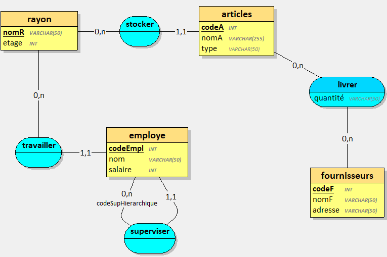
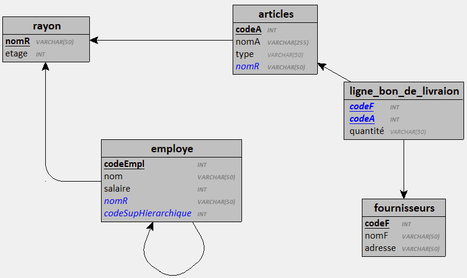

# Fournisseurs

## Docker 

Créer l'image :

`docker build -t mdevoldere/db-exo-fournisseurs . `

Créer le conteneur :

`docker run -d -p 3311:3306 -v exo-fournisseurs-data:/var/lib/mysql --name exo-fournisseurs-database mdevoldere/db-exo-fournisseurs`


## Base de données 







```sql
/* ajouter une colonne a article */
ALTER table articles ADD COLUMN prix INT NOT NULL DEFAULT '0';

 
/* mise a jour des prix */
UPDATE articles set prix=120 WHERE codeA='A0000001';
UPDATE articles set prix=50 WHERE codeA='A0000002';
UPDATE articles set prix=10 WHERE codeA='A0000003';
UPDATE articles set prix=1 WHERE codeA='A0000004';
UPDATE articles set prix=12 WHERE codeA='A0000005';
UPDATE articles set prix=500 WHERE codeA='A0000006';
UPDATE articles set prix=20 WHERE codeA='A0000007';
UPDATE articles set prix=40 WHERE codeA='A0000008';
UPDATE articles set prix=1.5 WHERE codeA='A0000009';
UPDATE articles set prix=3 WHERE codeA='A0000010';

```

## Requêtes à implémenter 

/* 1. Sélectionner tous les employés (codeEmpl, nom, salaire) triés par nom et par ordre alphabétique */ 

/* 2. Sélectionner tous les employés (codeEmpl, nom, salaire) avec, pour chaque employé, le nom du rayon dans lequel il travaille */

/* 3. Sélectionner tous les fournisseurs (codeFourn, nom) et le nombre de produits qu'ils fournissent, triés par nombre de produits décroissant */

/* 4. Sélectionner le nom des produits, leur prix, et le nom du fournisseur associé */


/* 5. Sélectionner le nom des produits, leur prix, et le nom du fournisseur pour chaque produit dont le prix est supérieur à la moyenne des prix des produits */

/* 6. Sélectionner tous les employés (codeEmpl, nom). Pour chaque employé, indiquer le nom du rayon, le nombre d'articles associés au rayon  */

/* 7. Sélectionner tous les articles (codeA, nomA). Pour chaque article, indiquer le nombre de livraisons et la quantité totale livrée. */

/* 8. Sélectionner tous les articles (codeA, nomA). Pour chaque article, indiquer le nom du fournisseur, le nom et l'étage du rayon où il est stocké, et l'employé qui y travaille (codeEmpl, nom). */
